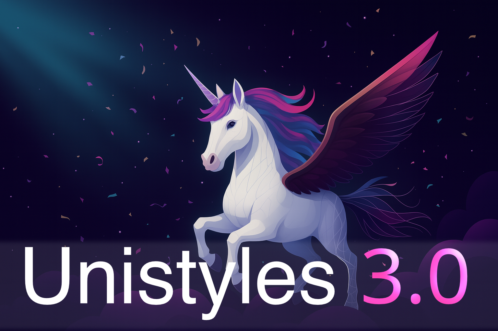

<!-- Introduction -->

    

  Jacek Pudysz

  CTO & Co-Founder @ Codemask

<!-- Socials -->

    
    
@jpudysz

    
    
@jpudysz

    
    
jpudysz

<!-- Unistyles sheet -->

react-native-unistyles

Level up your React Native StyleSheet

    
    
2.5k stars

    
    
2.4M downloads

<!-- Invisible click trigger -->

