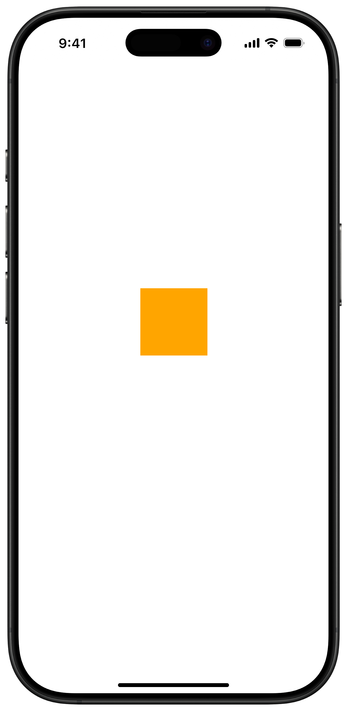

<style>
::view-transition-old(view-transition-circle),
::view-transition-new(view-transition-circle) {
  animation-duration: 500ms !important;
  animation-timing-function: ease-in-out;
}

::view-transition-group(view-transition-circle) {
  animation-duration: 500ms !important;
}

.view-transition-circle {
  view-transition-name: view-transition-circle;
}
</style>

<div
  v-motion
  :initial="{ opacity: 1, y:0 }"
  :click-2="{ opacity: 0, y: -50, transition: { duration: 600, ease: 'easeIn' } }"
>

<div class="flex items-center justify-center gap-1">

<div class="size-4 view-transition-circle bg-red border-red rounded-full mb-[10px] mr-2"></div>
<h1 class="font-geist text-xl text-white/90">
  zero cost runtime
</h1>

</div>

<h1 
  v-motion
  :initial="{ opacity: 0, y: 20 }"
  :click-1="{ opacity: 1, y: 0, transition: { duration: 800, ease: 'easeOut' } }"
  class="font-geist text-6xl font-bold"
>
    Is it even possible?
</h1>

</div>

<div 
  v-motion
  :initial="{ opacity: 0, y: 10 }"
  :click-2="{ opacity: 1, y: 0, transition: { duration: 800, ease: 'easeOut', delay: 300 } }"
  class="flex items-center gap-4 absolute top-0 left-15%"
>

<div class="flex gap-4 flex-col">

<span class="font-geist text-3xl font-bold">RN StyleSheet</span>

```tsx {all|all|all|3|6-10}

import { View, StyleSheet } from 'react-native'

<View style={styles.box} />

const styles = StyleSheet.create({
    box: {
        width: 100,
        height: 100,
        backgroundColor: 'orange',
    }
})
```

</div>



<div 
  v-motion
  :initial="{ opacity: 0 }"
  :click-5="{ opacity: 1 }"
  class="flex items-center gap-4 absolute top-0 left-15%"
>

<FancyArrow 
  from="(75, 330)" 
  to="(380, 270)" 
  color="red" 
  animated
  animation-duration="1000"
  animation-delay="500" />

</div>

</div>

<!-- Click triggers -->
<div v-click class="absolute inset-0 pointer-events-none"></div>

