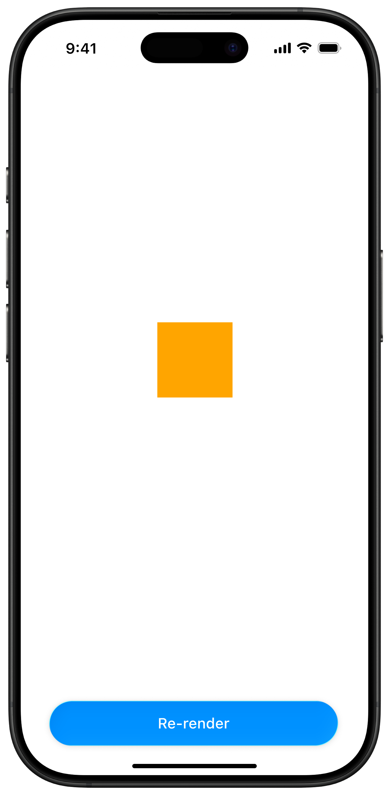

  

JSI Object

<!-- JS section with label and line -->

  

  
JS

  

<!-- C++ section with label and line -->

HostUnistyle.cpp

Cache

  

  
C++

  

style

<!-- Obj-C++ section with label and line -->

  

  
JS

  

<!-- Click triggers -->

